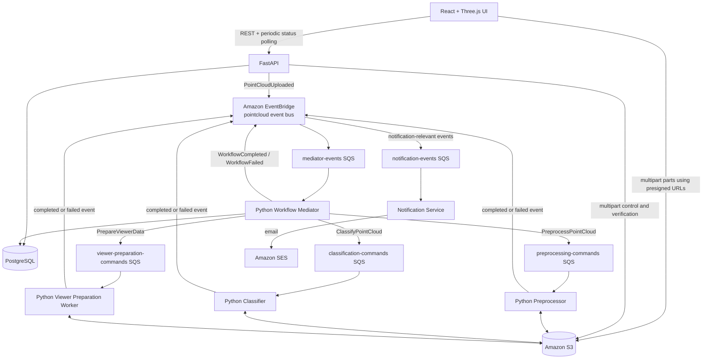
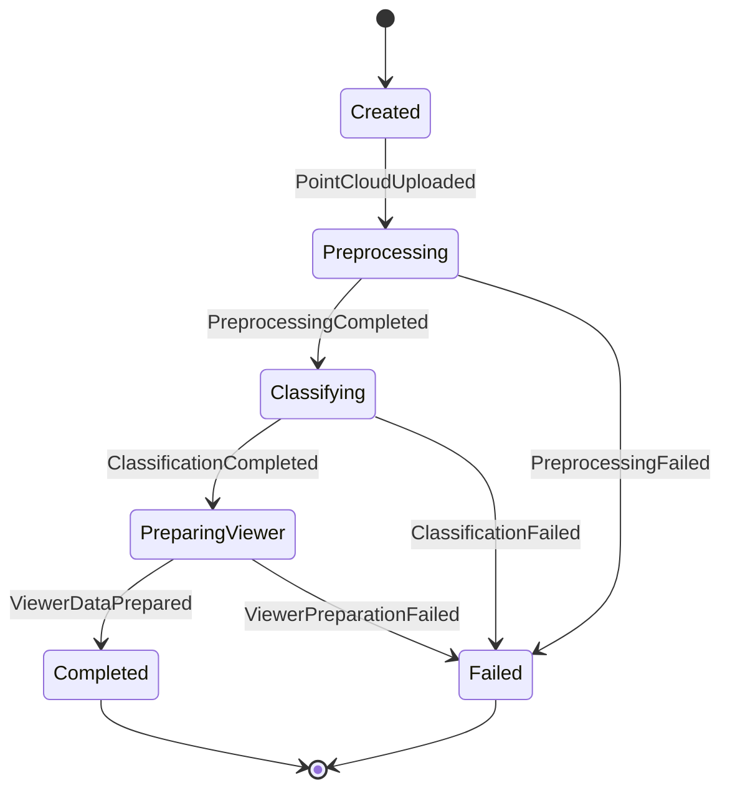
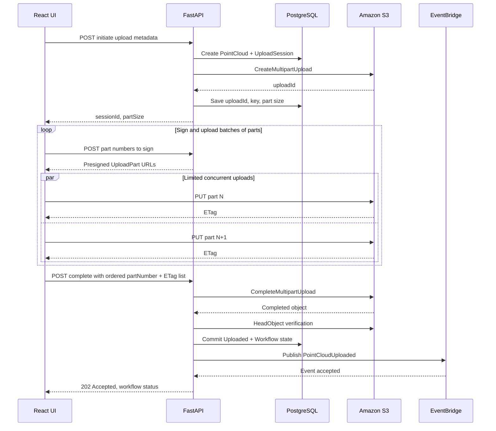
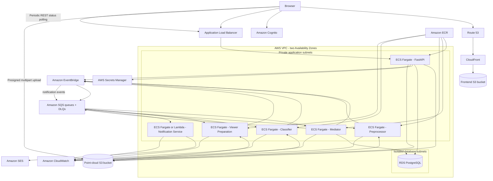

# Point Cloud Classification Platform

## Project Requirements and Architecture Specification

**Status:** Baseline requirements for the bachelor project  
**Primary stack:** Python, AWS, React, Three.js  
**Architecture style:** Event-driven architecture with a central workflow mediator/orchestrator  
**Upload decision:** Direct browser-to-S3 multipart upload  
**Upload completion decision:** The React application explicitly calls FastAPI after the multipart upload finishes. S3 object-created notifications are not used to start the workflow.

---

## 1. Purpose of this document

This document is the primary technical requirements reference for the project. It explains:

- what the platform must do;
- which services must be implemented;
- the responsibility and boundaries of each component;
- how large point-cloud uploads work;
- how the mediator coordinates preprocessing, classification, and viewer preparation;
- how state, files, messages, and notifications are stored and transported;
- how the solution is deployed to AWS;
- which reliability, security, and observability practices are required;
- what is intentionally outside the bachelor-project scope.

The document should be updated whenever an architectural decision changes.

---

## 2. Project summary

The project is a simplified cloud platform for uploading, processing, automatically classifying, visualizing, and downloading 3D point clouds.

A user will be able to:

1. authenticate;
2. create a project;
3. select a `.las` or `.laz` point-cloud file;
4. upload the file directly from the browser to Amazon S3 using multipart upload;
5. see upload progress, retries, cancellation, and optionally resume an interrupted upload;
6. explicitly finalize the upload through the FastAPI backend;
7. see the point cloud pass through preprocessing, classification, and viewer-preparation stages;
8. see processing status updates through periodic REST polling;
9. open the processed point cloud in a React/Three.js viewer;
10. toggle classes and visualization settings;
11. download the classified result.

The most important academic part is not reproducing every Pointly feature. The main contribution is a reliable event-driven workflow with clear service boundaries and a Python machine-learning worker.

---

## 3. Source basis and adaptation

The platform is inspired by the attached Pointly documentation, particularly these ideas:

- a cloud-based application for managing and classifying 3D point clouds;
- LAS and LAZ as supported point-cloud formats;
- an upload followed by asynchronous processing before the cloud becomes ready;
- a separate classification stage;
- a browser-based point-cloud viewer;
- a create-record, obtain-upload-access, upload-file, and check-status API workflow.

The AWS design in this document is an original simplified adaptation. It does not claim to reproduce Pointly's internal implementation.

The Pointly vectorization tools, advanced editing tools, subscription system, and multi-user editing are not MVP requirements.

---

## 4. Goals

### 4.1 Functional goals

- Manage users, projects, and point-cloud metadata.
- Upload large LAS/LAZ files without sending the file bytes through the FastAPI server.
- Process files asynchronously.
- Separate generic point-cloud processing from machine-learning inference.
- Keep the workflow recoverable after service restarts.
- Give the user upload and processing feedback.
- Render prepared point-cloud data in a web browser.
- Produce a downloadable classified LAS/LAZ output.

### 4.2 Architectural goals

- Use mediator topology at the system level.
- Use Amazon SQS queues for point-to-point commands and work distribution.
- Use Amazon EventBridge for integration events.
- Use Amazon S3 for large binary artifacts.
- Use PostgreSQL as the authoritative application and workflow state store.
- Make every message consumer idempotent.
- Avoid keeping large files or complete event histories in PostgreSQL.
- Allow processor and classifier workers to scale independently.

### 4.3 Learning goals

The implementation should demonstrate understanding of:

- event-driven architecture;
- orchestration versus choreography;
- mediator topology;
- asynchronous job processing;
- multipart object upload;
- distributed failure handling;
- retries and dead-letter queues;
- idempotent message consumers and duplicate-delivery handling;
- object storage;
- containerized deployment;
- client-side status polling and asynchronous notification design;
- infrastructure as code.

---

## 5. Non-goals for the MVP

The following are explicitly outside the first version:

- billing and subscriptions;
- enterprise organizations and quotas;
- simultaneous multi-user editing;
- advanced polygon-lasso, segment, and 3D bounding-box editing;
- vector-model creation and GeoJSON vectorization tools;
- custom model training from the UI;
- a marketplace of classifiers;
- automatic model selection;
- bulk export of many projects;
- event sourcing;
- separate read and write databases;
- Kubernetes;
- multi-region active-active deployment;
- strict compatibility with Pointly's API.

Manual reclassification can be implemented as a stretch goal after the upload-to-viewer pipeline is complete.

---

## 6. Chosen technology stack

| Area | Technology | Purpose |
|---|---|---|
| Frontend | React + TypeScript | User interface and project dashboard |
| 3D viewer | Three.js or React Three Fiber | Point-cloud visualization |
| API | FastAPI | REST endpoints, upload orchestration, CRUD, status queries |
| ORM and migrations | SQLAlchemy + Alembic | PostgreSQL persistence |
| AWS SDK | boto3 or aioboto3 | S3, SQS, EventBridge, and other AWS calls |
| Workflow mediator | Python service | Durable workflow orchestration |
| Preprocessor | Python worker | LAS/LAZ validation and metadata preparation |
| Classifier | Python worker | Machine-learning inference |
| Viewer preparation | Python worker | Browser-viewer data generation |
| Database | Amazon RDS for PostgreSQL | Business and workflow state |
| Object storage | Amazon S3 | Original, processed, classified, and viewer artifacts |
| Work queues | Amazon SQS | Commands and load leveling |
| Event bus | Amazon EventBridge | Integration-event routing |
| Processing status | REST polling through FastAPI | Browser periodically reads authoritative workflow status |
| Notification service | Python service or AWS Lambda | Email notifications now; future SSE/WebSocket push integration |
| Email delivery | Amazon SES | Send asynchronous completion/failure emails |
| Authentication | Amazon Cognito User Pool | User sign-in and JWT issuance |
| Containers | Amazon ECS on AWS Fargate | API, mediator, and CPU workers |
| Container registry | Amazon ECR | Docker image storage |
| Frontend hosting | S3 + CloudFront | Static React hosting and delivery |
| API ingress | Application Load Balancer | HTTPS access to FastAPI |
| Secrets | AWS Secrets Manager | Database credentials and private configuration |
| Logs and metrics | Amazon CloudWatch | Centralized observability |
| Infrastructure as code | Terraform | Repeatable AWS deployment |

### 6.1 GPU note

The baseline bachelor implementation should use a model that can run on CPU so the classifier can run on Fargate. If GPU inference becomes necessary, deploy the classifier on ECS with GPU-capable EC2 instances or another GPU-capable AWS service. Treat this as a later deployment variation, not an MVP dependency.

---

## 7. High-level logical architecture



---

## 8. Core architectural rule

The system uses the following separation:

- **FastAPI asks what the user wants.**
- **The mediator decides what should happen next.**
- **Workers perform one specialized operation.**
- **SQS carries commands to one logical worker type.**
- **EventBridge announces facts that have already happened.**
- **PostgreSQL stores authoritative state.**
- **S3 stores large files.**
- **The frontend reads processing state through REST polling; the notification subsystem handles asynchronous user notifications and future push channels.**

A worker must not decide the next workflow stage. The mediator is the only component that owns the processing sequence.

---

## 9. Required application services

## 9.1 React frontend

### Responsibilities

- Authenticate the user through Cognito.
- Display projects and point clouds.
- Start a multipart upload session through FastAPI.
- Split a file into parts in the browser.
- Request presigned URLs from FastAPI in batches.
- Upload parts directly to S3.
- Track total uploaded bytes and display accurate upload progress.
- Retry failed part uploads without restarting the complete file.
- Store the current upload session locally so the same browser session can recover.
- Call FastAPI to complete or abort the multipart upload.
- Poll the REST status endpoint while a point cloud is actively processing.
- Stop polling when the workflow reaches a terminal state such as `READY` or `FAILED`.
- Load viewer metadata and point-cloud tiles.
- Render the point cloud with Three.js.
- Request a presigned download URL for the final output.

### The frontend must not

- receive AWS credentials;
- upload through FastAPI;
- decide that an upload is complete without the backend completing it in S3;
- treat locally cached status as more authoritative than the REST status endpoint;
- publish integration events directly to EventBridge.

### Recommended frontend modules

```text
src/
  api/
  auth/
  projects/
  pointClouds/
  uploads/
  status/
  viewer/
  components/
  pages/
  types/
```

### Upload-progress source

Upload progress is calculated locally in the browser from transferred part bytes. It does not come from the notification service.

### Processing-progress source

Processing status is read from the authoritative FastAPI status endpoint. While a point cloud is in an active workflow state, the frontend should poll approximately every 5-10 seconds. Polling stops when the workflow reaches `READY` or `FAILED`.

A one-minute polling interval is not recommended for an actively waiting user because the UI could display stale state for almost a full minute.

---

## 9.2 FastAPI service

### Responsibilities

- Validate Cognito JWTs.
- Authorize access to projects and point clouds.
- Provide project and point-cloud CRUD endpoints.
- Create point-cloud and upload-session records.
- Initiate S3 multipart uploads.
- Generate presigned `UploadPart` URLs.
- List already uploaded parts to support resume.
- Complete multipart uploads.
- Abort multipart uploads.
- Verify the completed S3 object.
- Mark point clouds as uploaded.
- Create the processing workflow record.
- publish `PointCloudUploaded` directly to EventBridge after the upload and workflow state are committed;
- expose processing status endpoints;
- create presigned download URLs;
- delete point-cloud metadata and request S3 cleanup.

### The FastAPI service must not

- preprocess point clouds;
- run classification;
- generate viewer data;
- keep a request open while server-side processing runs;
- receive the complete point-cloud file body;
- depend on S3 object-created notifications.

### Suggested internal modules

```text
app/
  api/
    projects.py
    point_clouds.py
    uploads.py
    downloads.py
  auth/
  database/
  models/
  repositories/
  services/
    multipart_upload_service.py
    point_cloud_service.py
    event_publisher.py
  aws/
    s3_client.py
    eventbridge_client.py
  schemas/
  main.py
```

### Upload-completion decision

The only normal trigger for starting the processing workflow is a successful FastAPI upload-completion operation.

No S3 `ObjectCreated` event is configured as the workflow trigger.

---

## 9.3 Python workflow mediator

### Purpose

The mediator is the central orchestrator. It owns the state machine and decides which command is issued after each incoming event.

### Responsibilities

- Consume events from `mediator-events` SQS.
- Load the workflow from PostgreSQL.
- Check that an incoming event is valid for the workflow's current state.
- Ignore safely handled duplicate events.
- Update the workflow state.
- Send the next workflow command directly to the appropriate SQS queue.
- Publish terminal workflow events such as `WorkflowCompleted` and `WorkflowFailed`.
- Handle retry counts and terminal failures.
- Mark the point cloud `Ready` when all required stages finish.
- Mark the workflow and point cloud `Failed` when recovery is exhausted.
- Record concise failure details.

### The mediator must not

- download or process LAS/LAZ data;
- run machine-learning inference;
- create viewer tiles;
- call the frontend directly;
- use EventBridge or SQS as its workflow-state database.

### Workflow state machine



### Required state transitions

| Current state | Incoming event | State update | Outgoing command/event |
|---|---|---|---|
| `Created` | `PointCloudUploaded` | `Preprocessing` | `PreprocessPointCloud` |
| `Preprocessing` | `PreprocessingCompleted` | `Classifying` | `ClassifyPointCloud` |
| `Preprocessing` | `PreprocessingFailed` | retry or `Failed` | retry command or `WorkflowFailed` |
| `Classifying` | `ClassificationCompleted` | `PreparingViewer` | `PrepareViewerData` |
| `Classifying` | `ClassificationFailed` | retry or `Failed` | retry command or `WorkflowFailed` |
| `PreparingViewer` | `ViewerDataPrepared` | `Completed` | `WorkflowCompleted` |
| `PreparingViewer` | `ViewerPreparationFailed` | retry or `Failed` | retry command or `WorkflowFailed` |

### Persistence rule

The mediator stores one current workflow row in PostgreSQL. It does not require one permanent row for every state transition.

Detailed step events belong primarily in CloudWatch logs. An optional transition-history table may retain recent rows for a limited period.

---

## 9.4 Python preprocessor worker

### Purpose

Prepare a raw LAS/LAZ file so downstream components can rely on valid data and known metadata.

### Input command

`PreprocessPointCloud`

### Responsibilities

- Poll `preprocessing-commands` SQS.
- Download the original object from S3 to ephemeral task storage.
- Validate that the object is a readable LAS or LAZ file.
- Reject empty or unsupported files.
- Read the point count.
- Read the bounding box.
- Read LAS version and point format.
- Detect available dimensions such as RGB and intensity.
- Detect coordinate-reference information where available.
- Normalize or convert only when required by the classifier.
- Upload the prepared artifact to S3.
- Publish `PreprocessingCompleted` or `PreprocessingFailed` to EventBridge.
- Delete temporary local files after processing.

### Output artifacts

```text
processed/{point_cloud_id}/prepared.laz
processed/{point_cloud_id}/metadata.json
```

### Candidate libraries

- `laspy`;
- PDAL and Python bindings;
- `numpy`;
- `pyproj` where coordinate-system operations are needed.

### The preprocessor must not

- decide whether classification starts;
- update workflow state directly;
- send user notifications directly;
- store large outputs in PostgreSQL.

---

## 9.5 Python classification worker

### Purpose

Run the machine-learning model and assign class labels to points.

### Input command

`ClassifyPointCloud`

### Responsibilities

- Poll `classification-commands` SQS.
- Download the prepared point cloud from S3.
- Load the configured model version.
- Perform model-specific preprocessing.
- Run inference.
- Produce labels and optional confidence statistics.
- Write the labels into a classified LAS/LAZ result.
- Upload the classified artifact to S3.
- Publish `ClassificationCompleted` or `ClassificationFailed`.
- Emit model name, model version, duration, and basic class counts as event metadata.

### Output artifacts

```text
classified/{point_cloud_id}/classified.laz
classified/{point_cloud_id}/classification-summary.json
```

### The classifier must not

- decide the next workflow stage;
- create the browser-viewer representation unless that code is intentionally shared with the viewer worker;
- write directly to the workflow tables;
- expose a long-running synchronous classification endpoint to the browser.

### Model requirement for MVP

Use one predefined classifier and one known class catalog. A small CPU-compatible model is acceptable because the architectural pipeline is the primary project contribution.

---

## 9.6 Python viewer-preparation worker

### Purpose

Transform the classified result into a format that the browser viewer can load efficiently.

### Input command

`PrepareViewerData`

### Responsibilities

- Poll `viewer-preparation-commands` SQS.
- Download the classified LAS/LAZ object.
- Generate the chosen viewer representation.
- Create a viewer manifest with bounds, classes, colors, and asset locations.
- Upload all viewer artifacts to S3.
- Publish `ViewerDataPrepared` or `ViewerPreparationFailed`.
- Clean temporary local storage.

### Possible viewer strategies

Choose one during implementation:

1. **Potree-compatible output** generated by an appropriate converter; or
2. **Custom Three.js format** using spatial chunks and level-of-detail metadata.

Potree-compatible output is likely the more practical path for large point clouds. A small custom format is acceptable for limited demonstration datasets.

### Output artifacts

```text
viewer/{point_cloud_id}/manifest.json
viewer/{point_cloud_id}/...
```

### The viewer worker must not

- make workflow decisions;
- notify users directly;
- require direct database access.

---

## 9.7 Notification service

The notification service is retained as a separate integration component, but it is **not used by the frontend to obtain workflow status in the MVP**. React uses REST polling for that purpose.

### Deployment

For the MVP it may run as a small Python ECS/Fargate service or as AWS Lambda, depending on the chosen email implementation. It consumes notification-relevant events asynchronously.

### Responsibilities

- Consume notification-relevant events such as `WorkflowCompleted` and `WorkflowFailed`.
- Apply user notification preferences when those preferences are introduced.
- Convert internal workflow events into user-facing notification messages.
- Send completion/failure emails through Amazon SES.
- Remain independent from the workflow so notification failure never blocks processing.
- Provide an extension point for future SSE or WebSocket-based browser notifications.

### The notification service must not

- own authoritative workflow state;
- decide which processing stage runs next;
- be required for preprocessing, classification, or viewer preparation to continue;
- replace the REST status endpoint;
- send every low-level worker event to users unless it has a clear user-facing purpose.

### Future realtime extension

If the project later requires push updates instead of polling, this service can be extended to deliver notifications through SSE or API Gateway WebSockets. In that future version, the notification service would subscribe to UI-relevant workflow events and push them to connected clients while REST remains the authoritative recovery path.

---


## 10. AWS infrastructure components

## 10.1 Amazon S3

### Responsibilities

Store all large and generated artifacts:

```text
original/{point_cloud_id}/{safe_filename}
processed/{point_cloud_id}/prepared.laz
processed/{point_cloud_id}/metadata.json
classified/{point_cloud_id}/classified.laz
classified/{point_cloud_id}/classification-summary.json
viewer/{point_cloud_id}/manifest.json
viewer/{point_cloud_id}/...
```

### Required configuration

- Block Public Access enabled.
- Server-side encryption enabled.
- Bucket versioning optional for MVP.
- CORS configured only for the frontend origin.
- CORS permits `PUT` for presigned part uploads.
- CORS exposes the `ETag` response header.
- Lifecycle rule aborts incomplete multipart uploads after a configurable period, recommended seven days for development.
- Lifecycle rules remove temporary or orphaned processing data after the chosen retention period.
- Object keys are generated by the backend and are not raw user-provided paths.

### File-data rule

S3 is the authoritative location for file bytes. PostgreSQL stores keys and metadata only.

---

## 10.2 Amazon RDS for PostgreSQL

### Responsibilities

Store:

- users mapped to Cognito identities;
- projects;
- point-cloud metadata;
- upload-session metadata;
- processing workflow state;
- inbox/idempotency records;
- optional recent transition history.

### Recommended logical schemas

```text
app.projects
app.point_clouds
app.upload_sessions
workflow.processing_workflows
workflow.inbox_messages
```

The API and mediator may share one RDS instance for the bachelor project while respecting table ownership through repository boundaries.

### Database access

- FastAPI accesses application and upload tables.
- The mediator accesses workflow tables and updates point-cloud status.
- Workers should not access RDS directly in the MVP.
- The notification service does not require direct workflow-table access; it consumes notification events and uses only the data required for delivery.

---

## 10.3 Amazon SQS

### Required queues

```text
mediator-events
preprocessing-commands
classification-commands
viewer-preparation-commands
```

Each queue must have a matching dead-letter queue:

```text
mediator-events-dlq
preprocessing-commands-dlq
classification-commands-dlq
viewer-preparation-commands-dlq
```

### Queue role

- Commands are sent to one logical worker type.
- Multiple replicas of a worker compete for messages from the same queue.
- Standard queues are sufficient for the MVP.
- Consumers must support duplicate and out-of-order delivery.

### Required configuration concepts

- Long polling enabled.
- Visibility timeout greater than the normal job duration, or periodically extended while work is active.
- Maximum receive count configured before moving a message to a DLQ.
- Message retention chosen to allow operational recovery.
- CloudWatch alarms for growing queue age and DLQ depth.

### Message-completion rule

A worker deletes a command message only after:

1. the output artifact has been saved successfully;
2. the completion event has been published successfully to EventBridge;
3. the operation is safe to consider complete.

---

## 10.4 Amazon EventBridge

### Responsibilities

- Accept custom integration events from FastAPI, the mediator, and workers.
- Match events through rules.
- Route worker result events to `mediator-events` SQS.
- Route notification-relevant workflow events to `notification-events` SQS.
- Optionally route all events to CloudWatch Logs during development.

### EventBridge is not

- the workflow database;
- a store for point-cloud bytes;
- the place where the mediator's state machine is implemented.

### Recommended event bus

```text
pointcloud-platform-events
```

### Recommended rules

| Rule | Event pattern | Target |
|---|---|---|
| `route-upload-to-mediator` | `PointCloudUploaded` | `mediator-events` SQS |
| `route-worker-results-to-mediator` | completed and failed worker events | `mediator-events` SQS |
| `route-terminal-events-to-notifications` | `WorkflowCompleted` and `WorkflowFailed` | `notification-events` SQS |
| `archive-events-to-logs-dev` | all custom events in development | CloudWatch Logs |

Prefer one target per rule for maintainability.

---

## 10.5 Amazon ECS and AWS Fargate

### ECS services

- FastAPI service;
- workflow mediator service;
- preprocessing worker service;
- classification worker service;
- viewer-preparation worker service;
- notification service when deployed on ECS/Fargate.

### Responsibilities

- Run containerized Python applications.
- Restart failed tasks.
- Scale worker counts independently.
- Attach task-specific IAM roles.
- Send application logs to CloudWatch.

### Scaling strategy

- FastAPI: request count, CPU, and memory.
- Mediator: `mediator-events` queue age/depth.
- Preprocessor: preprocessing queue depth.
- Classifier: classification queue depth and CPU/memory.
- Viewer worker: viewer queue depth.

For the bachelor deployment, minimum task counts can remain small to control cost.

---

## 10.6 Amazon ECR

Store one versioned Docker image per deployable application:

```text
pointcloud-api
pointcloud-mediator
pointcloud-preprocessor
pointcloud-classifier
pointcloud-viewer-preparation
pointcloud-notification
```

Each deployment must use immutable image tags such as a Git commit SHA, not only `latest`.

---

## 10.7 Notification delivery

### MVP responsibilities

- Use `notification-events` SQS as a durable inbox for notification-relevant events.
- Use Amazon SES for email delivery.
- Keep email delivery asynchronous and independent from workflow completion.
- Retry transient notification failures without changing processing state.

### Future realtime option

API Gateway WebSocket API or SSE may be added later for push updates. This is not required by the MVP because React polls FastAPI for status.

---

## 10.8 Amazon Cognito

### Responsibilities

- Register and authenticate users.
- Issue access and ID JWTs.
- Provide the user identity used for project ownership.

### API requirement

FastAPI must verify JWT signature, issuer, audience/client identifier, expiration, and intended token use before trusting claims.

---

## 10.9 CloudFront and frontend S3 bucket

### Responsibilities

- Serve the built React application.
- Cache static assets.
- Enforce HTTPS.
- Restrict direct access to the frontend bucket through CloudFront Origin Access Control.

The frontend static bucket should be separate from the point-cloud data bucket.

---

## 10.10 Application Load Balancer

### Responsibilities

- Expose FastAPI over HTTPS.
- Perform health checks.
- Distribute requests between API task replicas.

The ALB is public. The FastAPI tasks run in private application subnets.

---

## 10.11 AWS Secrets Manager

Store:

- RDS credentials;
- application secrets that cannot be represented by IAM roles;
- optional third-party model or monitoring credentials.

Do not place secrets in Docker images, source control, Terraform state outputs, or React environment variables.

---

## 10.12 Amazon CloudWatch

### Responsibilities

- Application logs.
- Queue metrics.
- ECS CPU and memory metrics.
- Lambda logs and errors.
- API and ALB metrics.
- RDS metrics.
- Dashboard for workflow throughput and failures.
- Alarms for DLQs, error rates, stale workflows, and queue backlog.

### Required structured-log fields

```text
service
message_id
correlation_id
workflow_id
point_cloud_id
user_id where appropriate
event_type
command_type
stage
duration_ms
status
```

Never log presigned URLs, raw JWTs, database passwords, or complete sensitive payloads.

---

## 11. Direct S3 multipart-upload requirements

## 11.1 Why multipart upload is mandatory

Point-cloud files may be very large and may take minutes or hours to upload. Multipart upload allows independent parts to be retried and uploaded in parallel. A failed part must not force the user to restart the complete file.

The FastAPI server remains responsive because it signs and controls the upload but never transports the file bytes.

---

## 11.2 Multipart-upload sequence



---

## 11.3 Initiate upload

### Endpoint

```http
POST /api/projects/{project_id}/point-clouds/uploads
```

### Request

```json
{
  "fileName": "street-scan.laz",
  "fileSizeBytes": 8589934592,
  "contentType": "application/octet-stream"
}
```

### FastAPI actions

1. Authenticate the user.
2. Verify project ownership or access.
3. Validate `.las` or `.laz` extension.
4. Validate configured file-size limits.
5. Generate a point-cloud UUID.
6. Generate a safe S3 object key.
7. Choose the multipart part size.
8. Call S3 `CreateMultipartUpload`.
9. Store the returned S3 upload ID.
10. Return upload-session information.

### Response

```json
{
  "pointCloudId": "uuid",
  "uploadSessionId": "uuid",
  "partSizeBytes": 134217728,
  "status": "UPLOADING"
}
```

The response should not contain AWS credentials.

---

## 11.4 Part-size selection

Use a default such as 64 MiB or 128 MiB and increase it for exceptionally large files so the upload never exceeds S3's maximum part count.

The selected size must be saved in the upload session and must not change during that upload.

A conceptual calculation is:

```text
part_size = max(configured_default, ceil(file_size / maximum_part_count))
```

Round the result up to a convenient MiB boundary.

---

## 11.5 Presign upload parts

### Endpoint

```http
POST /api/uploads/{upload_session_id}/parts/presign
```

### Request

```json
{
  "partNumbers": [1, 2, 3, 4, 5]
}
```

### Response

```json
{
  "parts": [
    {"partNumber": 1, "url": "presigned-url"},
    {"partNumber": 2, "url": "presigned-url"}
  ],
  "expiresAt": "2026-01-01T13:00:00Z"
}
```

Generate URLs in batches rather than returning thousands of URLs in one response.

FastAPI must verify that:

- the session belongs to the authenticated user;
- the session is active;
- the requested part numbers are valid;
- the upload has not been completed or aborted.

---

## 11.6 Browser part upload

The frontend:

1. slices the file into blobs using the server-provided part size;
2. uploads a limited number of parts concurrently;
3. reads each response's `ETag` header;
4. records `{partNumber, ETag}`;
5. retries failed parts with backoff;
6. aggregates uploaded bytes for the progress bar.

### Recommended initial concurrency

Use four concurrent part uploads, configurable between three and six after testing.

### Progress formula

```text
total_progress = sum(uploaded_bytes_for_all_parts) / total_file_size
```

The UI should show:

- percentage;
- bytes uploaded versus total;
- current transfer rate where practical;
- estimated time remaining where practical;
- pause/cancel state;
- retry state.

---

## 11.7 Resume upload

### Endpoint

```http
GET /api/uploads/{upload_session_id}/parts
```

FastAPI calls S3 `ListParts` and returns uploaded part numbers and ETags.

The frontend compares this list with the expected parts and uploads only missing parts.

For the first MVP milestone, resume within the current browser session is required. Resume after browser restart is recommended and can use local storage or IndexedDB to retain the upload-session ID and selected-file metadata.

Because a browser cannot reopen a local file silently after a restart, the user may need to select the same file again before resume.

---

## 11.8 Complete upload - Option 1

### Endpoint

```http
POST /api/uploads/{upload_session_id}/complete
```

### Request

```json
{
  "parts": [
    {"partNumber": 1, "etag": "etag-value"},
    {"partNumber": 2, "etag": "etag-value"}
  ]
}
```

### FastAPI actions

1. Authenticate and authorize the user.
2. Load the upload session.
3. Validate that part numbers are unique and ordered.
4. Call S3 `CompleteMultipartUpload`.
5. Call S3 `HeadObject`.
6. Verify the object exists at the expected key.
7. Verify the object size matches the declared file size.
8. Optionally verify an S3 checksum when configured.
9. In one PostgreSQL transaction:
   - mark the upload session `COMPLETED`;
   - mark the point cloud `UPLOADED`;
   - create the processing workflow in `CREATED` state.
10. Publish `PointCloudUploaded` directly to EventBridge.
11. Return `202 Accepted` with the workflow identifier after EventBridge accepts the event.

### Critical decision

FastAPI starts the server-side workflow. S3 does not send an object-created notification to the mediator.

### Idempotency

The complete endpoint must be idempotent. If the browser retries after a network timeout, FastAPI must return the existing completed state rather than create a second workflow.

If S3 reports that the multipart upload no longer exists, FastAPI should check whether the final object already exists and matches the expected metadata before treating the request as failed.

Because the MVP publishes directly to EventBridge after the database commit, the completion endpoint must also be safe to retry when EventBridge publication fails or its response is uncertain. On retry, FastAPI should reuse the existing completed upload and workflow instead of creating new records, then attempt to publish `PointCloudUploaded` again when the workflow has not advanced. Duplicate delivery remains possible, so the mediator must handle the event idempotently.

---

## 11.9 Abort upload

### Endpoint

```http
DELETE /api/uploads/{upload_session_id}
```

### Actions

- call S3 `AbortMultipartUpload`;
- mark the upload session `ABORTED`;
- mark or delete the unprocessed point-cloud record according to the chosen UX;
- return a successful idempotent response if the upload was already aborted.

S3 lifecycle rules provide a final cleanup mechanism for abandoned multipart uploads.

---

## 11.10 Upload error handling

| Failure | Required behavior |
|---|---|
| Presigned URL expired | Request a new URL for that part |
| One part fails | Retry only that part |
| Browser temporarily offline | Pause and retry when network returns |
| Complete request times out | Retry idempotently |
| Invalid ETag list | Reject completion and keep session active |
| S3 complete succeeds but DB update fails | Retry DB finalization; reconcile orphan object if necessary |
| User cancels | Abort multipart upload |
| Upload remains incomplete too long | S3 lifecycle rule aborts it |

### Reconciliation

Because S3 completion and the PostgreSQL transaction cannot be atomic together, implement at least one of these:

- an idempotent completion endpoint that can recover by checking `HeadObject`;
- a scheduled reconciliation job for sessions stuck in `COMPLETING`;
- an orphan-object cleanup process.

A small scheduled Lambda is acceptable for reconciliation and cleanup.

---

## 12. Server-side processing workflow

## 12.1 End-to-end happy path

```text
1. FastAPI completes multipart upload.
2. FastAPI commits the completed upload and creates the workflow in PostgreSQL.
3. FastAPI publishes `PointCloudUploaded` directly to EventBridge.
4. EventBridge routes it to `mediator-events` SQS.
5. Mediator sets state to PREPROCESSING.
6. Mediator sends `PreprocessPointCloud` to `preprocessing-commands` SQS.
7. Preprocessor stores prepared data in S3 and publishes `PreprocessingCompleted`.
8. EventBridge routes the event to `mediator-events` SQS.
9. Mediator sets state to CLASSIFYING.
10. Mediator sends `ClassifyPointCloud` to `classification-commands` SQS.
11. Classifier stores classified data in S3 and publishes `ClassificationCompleted`.
12. Mediator sets state to PREPARING_VIEWER.
13. Mediator sends `PrepareViewerData` to `viewer-preparation-commands` SQS.
14. Viewer worker stores viewer data in S3 and publishes `ViewerDataPrepared`.
15. Mediator marks workflow COMPLETED and point cloud READY.
16. Mediator publishes `WorkflowCompleted`.
17. EventBridge routes `WorkflowCompleted` to `notification-events` SQS when user notification is required.
18. Notification Service may send a completion email through Amazon SES.
19. React discovers the `READY` state through its next status poll, requests the viewer manifest, and opens the cloud.
```

---

## 12.2 Failure behavior

Each worker publishes a typed failure event with a machine-readable error code and a safe human-readable summary.

Example:

```json
{
  "type": "pointcloud.classification.failed.v1",
  "data": {
    "workflowId": "uuid",
    "pointCloudId": "uuid",
    "errorCode": "MODEL_INFERENCE_FAILED",
    "retryable": true,
    "message": "Classification could not be completed"
  }
}
```

The mediator decides whether to:

- retry the same stage;
- move the command to manual investigation after retries are exhausted;
- mark the workflow failed.

Workers do not decide the overall workflow result.

---

## 12.3 Retry policy

Suggested baseline:

- automatic application-level retries for transient AWS/network failures;
- up to three workflow-stage attempts;
- exponential backoff where practical;
- terminal failure for invalid input or unsupported format;
- DLQ after the queue's maximum receives is exceeded.

Retry counts belong in the workflow record or stage-attempt metadata, not only in memory.

---

## 13. Message contracts

## 13.1 Standard envelope

All commands and events should use a versioned envelope:

```json
{
  "messageId": "uuid",
  "messageType": "pointcloud.preprocessing.completed.v1",
  "occurredAt": "2026-01-01T12:00:00Z",
  "source": "pointcloud-preprocessor",
  "correlationId": "workflow-uuid",
  "causationId": "previous-message-uuid",
  "data": {}
}
```

### Field meaning

- `messageId`: unique idempotency key;
- `messageType`: versioned contract identifier;
- `occurredAt`: UTC timestamp;
- `source`: publishing service;
- `correlationId`: workflow ID;
- `causationId`: message that caused this message;
- `data`: event- or command-specific payload.

Never put point-cloud bytes in a message.

---

## 13.2 Commands

### `pointcloud.preprocessing.requested.v1`

```json
{
  "workflowId": "uuid",
  "pointCloudId": "uuid",
  "inputBucket": "bucket-name",
  "inputKey": "original/uuid/file.laz",
  "outputKey": "processed/uuid/prepared.laz"
}
```

### `pointcloud.classification.requested.v1`

```json
{
  "workflowId": "uuid",
  "pointCloudId": "uuid",
  "inputKey": "processed/uuid/prepared.laz",
  "outputKey": "classified/uuid/classified.laz",
  "modelId": "baseline-model",
  "modelVersion": "1"
}
```

### `pointcloud.viewer-preparation.requested.v1`

```json
{
  "workflowId": "uuid",
  "pointCloudId": "uuid",
  "inputKey": "classified/uuid/classified.laz",
  "outputPrefix": "viewer/uuid/"
}
```

---

## 13.3 Events

Required integration events:

```text
pointcloud.uploaded.v1
pointcloud.preprocessing.completed.v1
pointcloud.preprocessing.failed.v1
pointcloud.classification.completed.v1
pointcloud.classification.failed.v1
pointcloud.viewer-preparation.completed.v1
pointcloud.viewer-preparation.failed.v1
pointcloud.workflow.completed.v1
pointcloud.workflow.failed.v1
```

Contracts must be backward compatible within a version. Breaking changes require a new version suffix.

---

## 14. Persistence model

## 14.1 Users

```text
users
- id UUID
- cognito_sub VARCHAR UNIQUE
- email VARCHAR
- display_name VARCHAR
- created_at TIMESTAMPTZ
```

Cognito remains the authentication source. The local table stores application-specific profile and ownership references.

---

## 14.2 Projects

```text
projects
- id UUID
- owner_user_id UUID
- name VARCHAR
- description TEXT NULL
- created_at TIMESTAMPTZ
- updated_at TIMESTAMPTZ
```

---

## 14.3 Point clouds

```text
point_clouds
- id UUID
- project_id UUID
- owner_user_id UUID
- original_file_name VARCHAR
- status VARCHAR
- original_s3_key VARCHAR NULL
- processed_s3_key VARCHAR NULL
- classified_s3_key VARCHAR NULL
- viewer_prefix VARCHAR NULL
- file_size_bytes BIGINT
- point_count BIGINT NULL
- min_x DOUBLE PRECISION NULL
- min_y DOUBLE PRECISION NULL
- min_z DOUBLE PRECISION NULL
- max_x DOUBLE PRECISION NULL
- max_y DOUBLE PRECISION NULL
- max_z DOUBLE PRECISION NULL
- model_id VARCHAR NULL
- model_version VARCHAR NULL
- failure_code VARCHAR NULL
- failure_message TEXT NULL
- created_at TIMESTAMPTZ
- updated_at TIMESTAMPTZ
```

Suggested statuses:

```text
UPLOADING
UPLOADED
PREPROCESSING
CLASSIFYING
PREPARING_VIEWER
READY
FAILED
DELETING
DELETED
```

---

## 14.4 Upload sessions

```text
upload_sessions
- id UUID
- point_cloud_id UUID UNIQUE
- s3_bucket VARCHAR
- s3_key VARCHAR
- s3_upload_id VARCHAR UNIQUE
- part_size_bytes BIGINT
- expected_file_size_bytes BIGINT
- status VARCHAR
- created_at TIMESTAMPTZ
- expires_at TIMESTAMPTZ
- completed_at TIMESTAMPTZ NULL
- aborted_at TIMESTAMPTZ NULL
```

Suggested statuses:

```text
INITIATED
UPLOADING
COMPLETING
COMPLETED
ABORTED
EXPIRED
FAILED
```

Do not create one permanent PostgreSQL row per uploaded part unless a concrete requirement justifies it. Use S3 `ListParts` for recovery.

---

## 14.5 Processing workflows

```text
processing_workflows
- id UUID
- point_cloud_id UUID UNIQUE
- state VARCHAR
- current_stage VARCHAR
- state_version INTEGER
- attempt_number INTEGER
- started_at TIMESTAMPTZ
- completed_at TIMESTAMPTZ NULL
- failed_at TIMESTAMPTZ NULL
- failure_code VARCHAR NULL
- failure_message TEXT NULL
- created_at TIMESTAMPTZ
- updated_at TIMESTAMPTZ
```

### Concurrency control

Use optimistic concurrency through `state_version`, or row locking when handling a workflow event. This prevents two mediator replicas from advancing the same workflow twice.

---

## 14.6 Inbox messages

```text
inbox_messages
- message_id UUID
- consumer_name VARCHAR
- processed_at TIMESTAMPTZ
- PRIMARY KEY (message_id, consumer_name)
```

The unique key prevents the same consumer from applying a duplicate message twice.

---

## 14.7 Workflow history and retention

The source of truth is the current `processing_workflows` row.

Detailed per-transition rows are optional. If implemented:

- retain successful transition history for 7 to 30 days;
- retain failed workflow details for 60 to 90 days;
- store long-term aggregate metrics in CloudWatch or a compact metrics table;
- do not retain unbounded raw transition rows in the transactional database.

---

## 15. API requirements

## 15.1 Project endpoints

```text
POST   /api/projects
GET    /api/projects
GET    /api/projects/{project_id}
PATCH  /api/projects/{project_id}
DELETE /api/projects/{project_id}
```

## 15.2 Point-cloud endpoints

```text
GET    /api/projects/{project_id}/point-clouds
GET    /api/point-clouds/{point_cloud_id}
GET    /api/point-clouds/{point_cloud_id}/status
GET    /api/point-clouds/{point_cloud_id}/viewer-manifest
POST   /api/point-clouds/{point_cloud_id}/download-url
DELETE /api/point-clouds/{point_cloud_id}
```

## 15.3 Upload endpoints

```text
POST   /api/projects/{project_id}/point-clouds/uploads
POST   /api/uploads/{upload_session_id}/parts/presign
GET    /api/uploads/{upload_session_id}/parts
POST   /api/uploads/{upload_session_id}/complete
DELETE /api/uploads/{upload_session_id}
```

## 15.4 Status response

```json
{
  "pointCloudId": "uuid",
  "status": "CLASSIFYING",
  "workflowId": "uuid",
  "currentStage": "classification",
  "startedAt": "2026-01-01T12:00:00Z",
  "updatedAt": "2026-01-01T12:03:00Z",
  "failure": null
}
```

The status endpoint is authoritative and is the normal source used by the frontend for processing-state updates.

---

## 16. Processing status and notification requirements

### 16.1 Upload progress

Upload progress is calculated by the browser from transferred multipart bytes. This progress is local to the upload transfer and is separate from server-side processing status.

### 16.2 Processing status polling

The frontend obtains server-side processing status by periodically calling:

```text
GET /api/point-clouds/{id}/status
```

Recommended behavior:

- poll every 5-10 seconds while the point cloud is in an active state;
- optionally back off to a slower interval for very long-running jobs;
- stop polling when the state becomes `READY` or `FAILED`;
- immediately refresh status when the user revisits or reloads the page.

PostgreSQL remains the authoritative source of workflow state, exposed through FastAPI.

### 16.3 Notification service

The notification service is separate from status polling. Its MVP purpose is asynchronous user notification for meaningful events such as workflow completion or failure, for example by email through Amazon SES.

Notification delivery is best effort and must never affect workflow success.

### 16.4 Future push notifications

A future version may replace or supplement polling with SSE or WebSockets. The notification service is the natural component to own that delivery concern. Even after push notifications are added, the REST status endpoint should remain the authoritative recovery mechanism after reconnects or missed notifications.

---

## 17. Reliability requirements

## 17.1 At-least-once delivery

SQS standard queues can deliver a message more than once. Every consumer must therefore be idempotent.

Required mechanisms:

- unique `messageId`;
- inbox table;
- state-transition validation;
- deterministic S3 output keys;
- safe handling when an output already exists.

---

## 17.2 Dead-letter queues

Every SQS queue must have a DLQ.

An operator or developer must be able to:

- inspect the failed message;
- correlate it with a workflow;
- understand the last error;
- fix the cause;
- redrive the message when safe.

---

## 17.3 Stale-workflow detection

A scheduled monitor must detect workflows that remain in one stage beyond a configured threshold.

Possible responses:

- emit an alarm;
- retry the stage if safe;
- mark it for manual investigation;
- fail the workflow after the maximum timeout.

---

## 17.4 Worker shutdown

Workers must handle termination signals gracefully:

- stop receiving new messages;
- finish or safely abandon current work;
- extend visibility while finishing where necessary;
- avoid deleting the SQS message if work did not finish;
- clean temporary disk files.

---

## 18. Security requirements

## 18.1 Authentication and authorization

- Cognito authenticates users.
- FastAPI verifies JWTs.
- Every project and upload request checks resource ownership.
- Notification delivery must use the authenticated user identity and stored notification preferences/contact information.
- Emails and any future realtime messages must be sent only to the correct user.

## 18.2 S3 security

- Block Public Access.
- Use presigned URLs with short expiration.
- Sign each URL only for one bucket, key, upload ID, and part number.
- Limit CORS origins.
- Do not expose bucket-list permissions.
- Use server-side encryption.
- Avoid predictable object keys without authorization checks.

## 18.3 IAM

Use a separate IAM role for each ECS task and Lambda.

Examples:

- API role: initiate/complete/abort multipart uploads for allowed prefixes, write EventBridge events, read secrets;
- preprocessor role: read `original/`, write `processed/`, consume preprocessing SQS, publish events;
- classifier role: read `processed/`, write `classified/`, consume classification SQS, publish events;
- viewer role: read `classified/`, write `viewer/`, consume viewer SQS, publish events;
- mediator role: consume mediator SQS, send command queues, publish events, read database secret;
- notification role: consume `notification-events` SQS and send email through Amazon SES; future realtime permissions are added only if that feature is implemented.

Apply least privilege.

## 18.4 Database security

- RDS resides in isolated/private subnets.
- No public RDS endpoint.
- Only relevant ECS security groups can connect.
- Use TLS for database connections.
- Store credentials in Secrets Manager.
- Apply migrations through a controlled deployment task.

## 18.5 Input safety

- Validate file extension and declared size before upload.
- Validate the actual LAS/LAZ structure during preprocessing.
- Sanitize displayed file names.
- Generate internal object keys on the server.
- Do not execute user-provided commands or arbitrary pipeline definitions.

---

## 19. Deployment architecture




---

## 19.1 Network layout

### Public resources

- Application Load Balancer;
- CloudFront;

### Private application subnets

- FastAPI ECS tasks;
- mediator ECS tasks;
- processing workers.

### Isolated database subnets

- RDS PostgreSQL.

### Managed regional services

- S3;
- SQS;
- EventBridge;
- ECR;
- Amazon SES;
- Cognito;
- CloudWatch;
- Secrets Manager.

Use VPC endpoints where cost and complexity permit. A smaller student deployment may initially use a NAT gateway for private-task outbound access.

---

## 19.2 Environment strategy

At minimum define:

```text
dev
prod
```

Each environment should have separate:

- S3 buckets;
- queues and DLQs;
- EventBridge bus or environment-specific event sources;
- RDS database;
- Cognito configuration;
- ECS services;
- notification delivery configuration;
- CloudWatch log groups.

Do not reuse production point-cloud data in development.

---

## 19.3 Terraform structure

```text
infrastructure/
  modules/
    network/
    frontend/
    api/
    ecs-service/
    rds/
    s3/
    messaging/
    notifications/
    cognito/
    observability/
  environments/
    dev/
    prod/
```

Terraform must create repeatable resources and output only non-secret identifiers.

---

## 20. Repository structure

A monorepo is recommended, while every deployable service remains independently buildable and deployable.

```text
pointcloud-platform/
  frontend/
    src/
    package.json
    Dockerfile

  services/
    api/
      app/
      tests/
      pyproject.toml
      Dockerfile
    mediator/
      app/
      tests/
      pyproject.toml
      Dockerfile
    preprocessor/
      app/
      tests/
      pyproject.toml
      Dockerfile
    classifier/
      app/
      tests/
      pyproject.toml
      Dockerfile
    viewer-preparation/
      app/
      tests/
      pyproject.toml
      Dockerfile
    notification/
      app/
      tests/
      pyproject.toml
      Dockerfile

  contracts/
    events/
    commands/

  infrastructure/
    terraform/

  docs/
    architecture/
    adr/
    api/

  docker-compose.yml
  README.md
```

### Service-independence rule

- A service must never import another service's internal Python modules.
- Each service owns its own `pyproject.toml`, tests, Dockerfile, configuration, and runtime dependencies.
- Each Docker image must be self-contained so services can be deployed independently to ECS/Fargate.
- Services communicate through HTTP, SQS, EventBridge, S3, and explicitly owned persistence interfaces rather than direct code imports.
- A change to one service should not require rebuilding unrelated services unless a shared integration contract changed.

### Contracts rule

The `contracts/` directory contains only integration contracts such as versioned event and command schemas. It must not become a general-purpose shared business-logic package.

Acceptable shared artifacts include:

- event envelopes and schema definitions;
- command schema definitions;
- schema documentation or generated models where useful.

Do not place workflow logic, repositories, classifier logic, or service-specific AWS access code in `contracts/`.

For stronger production isolation, contracts may later be published as a versioned internal package or maintained as language-neutral schemas. Regardless of packaging, each deployed service must contain everything it needs at runtime.

---

## 21. Local development

Recommended local stack:

- React development server;
- all Python services in Docker;
- PostgreSQL container;
- LocalStack for S3, SQS, and EventBridge where practical;
- optional local email sink or SES development substitute;
- seeded small LAS/LAZ test files.

### Local goals

A developer should be able to run:

```text
docker compose up
```

and exercise the complete flow with a small test cloud.

AWS integration tests should also run against a dedicated AWS development environment before release.

---

## 22. Testing requirements

## 22.1 Unit tests

- upload part-size calculation;
- authorization rules;
- workflow transition validation;
- idempotency behavior;
- event-schema validation;
- metadata extraction;
- classifier input/output transformations;
- viewer-manifest generation.

## 22.2 Integration tests

- initiate/sign/complete/abort multipart upload;
- presigned URL CORS behavior;
- SQS consumer behavior;
- EventBridge routing;
- RDS migrations;
- direct EventBridge publication from FastAPI and mediator;
- DLQ behavior;
- notification-event consumption and email delivery behavior.

## 22.3 End-to-end tests

1. Create a project.
2. Upload a small LAZ using multipart upload.
3. Complete upload through FastAPI.
4. Verify workflow stages.
5. Verify status polling and, when enabled, completion/failure notification events.
6. Open viewer data.
7. Download classified result.

## 22.4 Failure tests

- kill a worker during processing;
- deliver the same message twice;
- expire a presigned part URL;
- complete the same upload twice;
- make the classifier fail;
- make notification delivery fail;
- create a stale workflow;
- move a message to a DLQ.

## 22.5 Performance tests

- large multipart upload with parallel parts;
- multiple concurrent uploads;
- queue backlog and worker scaling;
- viewer load time with target demonstration datasets;
- classification duration and memory use.

---

## 23. Functional requirements

### FR-001 Authentication

The user shall sign in through Cognito before accessing project data.

### FR-002 Project management

The user shall create, list, view, rename, and delete owned projects.

### FR-010 Upload initiation

The user shall initiate a multipart upload for a LAS or LAZ file through FastAPI.

### FR-011 Direct upload

The browser shall upload every file part directly to S3 using presigned URLs.

### FR-012 Upload progress

The UI shall show uploaded bytes and percentage during transfer.

### FR-013 Part retry

The UI shall retry an individual failed part without restarting successful parts.

### FR-014 Upload cancellation

The user shall be able to abort an active multipart upload.

### FR-015 Upload resume

The application shall list already uploaded parts and resume missing parts for an active session.

### FR-016 Explicit completion

The UI shall call FastAPI to complete the multipart upload. S3 notifications shall not start the workflow.

### FR-020 Workflow creation

FastAPI shall create one processing workflow after successful upload completion.

### FR-021 Preprocessing

The platform shall validate the LAS/LAZ file and extract point-cloud metadata asynchronously.

### FR-022 Classification

The platform shall run one configured classification model asynchronously.

### FR-023 Viewer preparation

The platform shall generate browser-consumable viewer data asynchronously.

### FR-024 Ready state

The mediator shall mark the point cloud ready only after all required stages complete.

### FR-030 Processing status polling

The frontend shall periodically retrieve processing-stage status from the FastAPI status endpoint while a point cloud is actively processing.

### FR-031 Status recovery

The user shall retrieve authoritative status through REST after reload, revisit, or temporary network interruption.

### FR-032 Asynchronous notifications

The notification service shall be able to consume completion/failure events and send user notifications such as email without participating in workflow orchestration.

### FR-040 Visualization

The frontend shall display the prepared point cloud and allow basic navigation, point-size adjustment, and class visibility toggles.

### FR-050 Download

The user shall obtain a time-limited download URL for the classified output.

### FR-060 Failure visibility

The UI shall show a safe failure state and message when the workflow fails.

---

## 24. Non-functional requirements

### NFR-001 Large-file handling

Large file bytes shall never pass through FastAPI.

### NFR-002 Durability

Workflow state shall survive service restarts.

### NFR-003 Idempotency

Every message consumer and upload-completion operation shall tolerate retries and duplicates.

### NFR-004 Security

All external communication shall use HTTPS, and all AWS access shall use IAM roles or short-lived presigned URLs. Any future WebSocket integration shall use secure WebSocket transport.

### NFR-005 Scalability

Preprocessing, classification, and viewer-preparation workers shall scale independently.

### NFR-006 Observability

Every workflow and message shall be traceable by correlation and workflow IDs.

### NFR-007 Recoverability

Failed messages shall be available in DLQs and stale workflows shall be detectable.

### NFR-008 Cost awareness

The student deployment shall use small minimum task counts and avoid unnecessary always-on services.

### NFR-009 Data retention

Operational history shall use explicit retention policies rather than growing without limit.

### NFR-010 Portability

Business logic shall depend on storage, message, and repository interfaces rather than scattering boto3 calls throughout the codebase.

---

## 25. Implementation phases

## Phase 1 - Foundation

- monorepo;
- FastAPI project;
- React project;
- PostgreSQL models and migrations;
- Cognito authentication;
- project CRUD;
- point-cloud metadata CRUD.

## Phase 2 - Multipart upload

- initiate multipart upload;
- presign parts;
- direct browser upload;
- progress display;
- retry;
- list parts;
- complete;
- abort;
- S3 lifecycle cleanup.

## Phase 3 - Messaging and mediator

- EventBridge bus;
- SQS queues and DLQs;
- message envelope;
- processing workflow table;
- mediator state machine;
- inbox/idempotency mechanism for duplicate message handling.

## Phase 4 - Preprocessor

- LAS/LAZ validation;
- metadata extraction;
- processed artifact upload;
- completion and failure events.

## Phase 5 - Classifier

- baseline model;
- classified LAZ output;
- classification summary;
- completion and failure events.

## Phase 6 - Viewer preparation and viewer

- viewer format decision;
- viewer worker;
- manifest;
- Three.js viewer;
- class visibility;
- basic navigation.

## Phase 7 - Status polling and notifications

- frontend processing-status polling;
- polling stop/backoff behavior;
- `notification-events` SQS routing;
- notification service implementation;
- Amazon SES email integration for completion/failure notifications;
- document SSE/WebSocket delivery as a future extension.

## Phase 8 - Deployment and hardening

- Terraform;
- ECR;
- ECS Fargate;
- RDS;
- CloudFront;
- ALB;
- Secrets Manager;
- CloudWatch dashboards and alarms;
- failure tests;
- documentation.

---

## 26. MVP acceptance scenario

The MVP is accepted when this scenario succeeds:

1. A registered user signs in.
2. The user creates a project.
3. The user selects a valid LAZ file.
4. The browser initializes multipart upload.
5. The browser uploads at least two parts directly to S3.
6. The UI displays upload progress.
7. One intentionally failed part is retried successfully.
8. The UI calls FastAPI to complete the upload.
9. FastAPI verifies the S3 object and creates a workflow.
10. The mediator advances the workflow through all three stages.
11. Each worker stores its output in S3.
12. While processing is active, the UI refreshes the current stage through periodic REST polling.
13. Reloading the browser restores the correct state through REST.
14. The point cloud becomes `READY`.
15. The Three.js viewer opens the prepared data.
16. The user can hide/show at least one classification class.
17. The user can download the classified LAZ through a presigned URL.
18. Duplicate delivery of one workflow event does not duplicate the next stage.
19. A failed test message can be observed in a DLQ.

---

## 27. Future improvements

- transactional outbox for reliable database-state and event publication as the system is hardened for production;
- manual point reclassification;
- multiple classifiers;
- model selection per upload;
- GPU classifier deployment;
- chunk-level classification for extremely large clouds;
- cancellation of active processing;
- workflow pause/resume;
- annotations;
- project sharing;
- class-catalog editing;
- vectorization and GeoJSON export;
- bulk upload and export;
- fine-grained progress inside classification;
- replace or supplement REST polling with SSE or WebSocket push notifications through the notification service;
- AWS Step Functions comparison;
- CloudFront delivery of private viewer tiles with signed access;
- dedicated analytics store;
- cross-account or multi-environment event routing;
- automated data archival.

---

## 28. Architectural decision records to create

Create short ADR files for at least these decisions:

```text
ADR-001 Python and AWS stack
ADR-002 Mediator topology
ADR-003 SQS for commands and EventBridge for events
ADR-004 Direct S3 multipart upload
ADR-005 FastAPI completion trigger instead of S3 notification
ADR-006 PostgreSQL as workflow source of truth
ADR-007 Idempotent consumers and duplicate-delivery handling
ADR-008 REST polling for processing status and notification-service separation
ADR-009 Viewer representation choice
ADR-010 CPU versus GPU classifier deployment
```

---

## 29. Important invariants

These rules must remain true throughout implementation:

1. There is at most one active processing workflow per point-cloud upload.
2. A point cloud is not `UPLOADED` until S3 multipart completion is verified.
3. A point cloud is not `READY` until viewer data exists.
4. A worker never decides the next stage.
5. Workflow state is never stored only in memory, SQS, or EventBridge.
6. S3 is never used as the relational application database.
7. PostgreSQL never stores entire point-cloud files.
8. Status polling and notification delivery are never required for workflow success.
9. The browser never receives permanent AWS credentials.
10. Duplicate messages must not duplicate business effects.
11. Every outgoing message has a versioned type and correlation ID.
12. Every processing artifact uses a deterministic, workflow-related S3 key.
13. The UI calls FastAPI to finalize uploads; S3 does not initiate the workflow.
14. Failed and incomplete multipart uploads are eventually aborted.
15. The REST status endpoint remains authoritative.

---

## 30. Reference documentation to consult during implementation

### Pointly source documents supplied with the project

- *Pointly User Guide* - product workflow, LAS/LAZ support, processing, classification, and viewer concepts.
- *Pointly API Specification* - create/upload/status/download concepts.
- *Pointly Vectorization Tools User Guide* - future-scope reference only.

### AWS official documentation

- Amazon S3: *Uploading an object using multipart upload*.
- Amazon S3 API: *CreateMultipartUpload*, *UploadPart*, *CompleteMultipartUpload*, *AbortMultipartUpload*, and *ListParts*.
- Amazon S3: *Multipart upload limits*.
- Amazon S3: *Download and upload objects with presigned URLs*.
- Amazon SQS: *Standard queues* and *Dead-letter queues*.
- Amazon EventBridge: *Event buses*, *Rules*, and *Targets*.
- Amazon SES: email sending and identity/domain verification.
- Amazon API Gateway WebSocket APIs or SSE deployment guidance should be consulted only if realtime push is implemented later.
- Amazon ECS: *Fargate tasks and services* and *Service Auto Scaling*.
- Amazon RDS: *Amazon RDS for PostgreSQL*.
- Amazon Cognito: *User pools and JWTs*.
- Amazon CloudFront: *Restrict access to an S3 origin with Origin Access Control*.
- AWS Secrets Manager documentation.
- Amazon ECR: *Using ECR images with ECS*.

AWS limits and service behavior should be checked again immediately before implementation and deployment.

---

## 31. Final architecture statement

The platform is a React and Three.js web application backed by Python services on AWS. FastAPI owns the user-facing REST API and controls direct S3 multipart uploads. After the UI explicitly completes an upload through FastAPI, FastAPI commits the upload and workflow state and then publishes `PointCloudUploaded` directly to EventBridge. A durable Python mediator stores workflow state in PostgreSQL and orchestrates preprocessing, machine-learning classification, and viewer preparation by sending commands through SQS. Specialized Python workers read and write large artifacts in S3 and publish result events through EventBridge. A separate notification service consumes notification-relevant events and can send completion or failure emails through Amazon SES; it also provides the extension point for future SSE or WebSocket push notifications. The React frontend obtains current processing status by polling the authoritative FastAPI status endpoint. ECS Fargate runs the API, mediator, and CPU workers, while Terraform defines the complete deployment.
